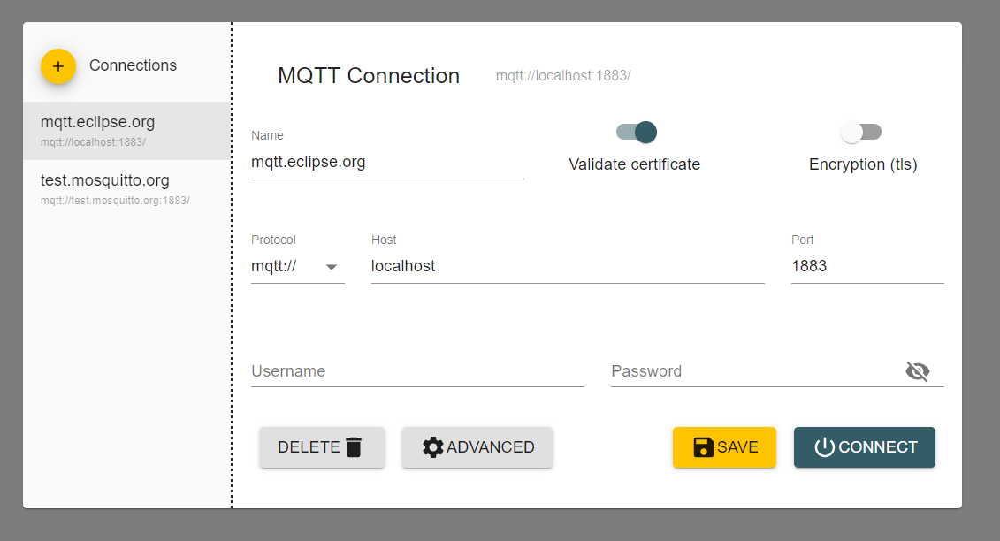

Correr el proyecto: fastapi dev main.py
Entrar a Swagger: http://127.0.0.1:8000/docs

Levantar broker:

1. tener docker desktop
2. abrir cmd y correr: docker run -d --name mi-broker -p 1883:1883 eclipse-mosquitto
3. verficar que el servicio aparece en docket desktop, manejarlo desde ahi
4. OPCIONAL: instalar MQTT Explorer para observar los eventos enviados al broker

FALTA:
- Autenticacion para permitir lectura *revisar